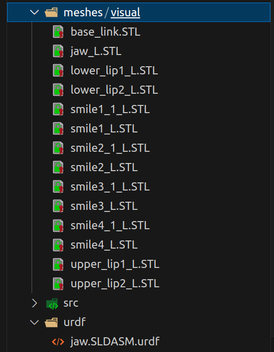
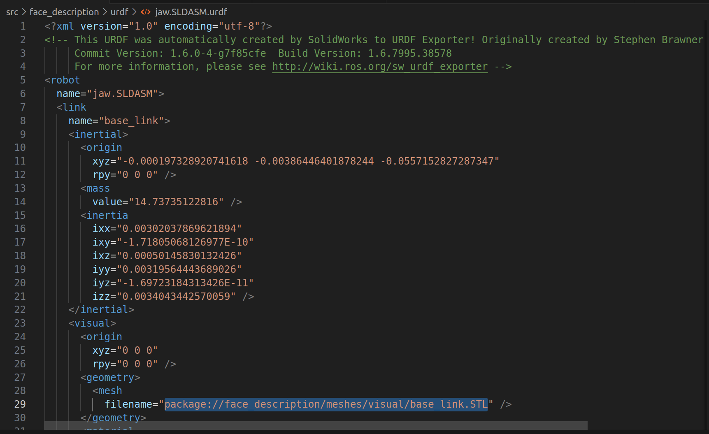
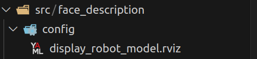
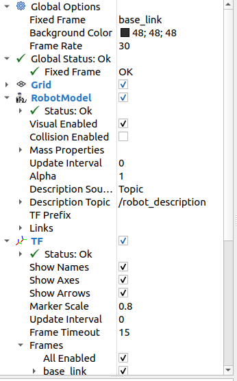
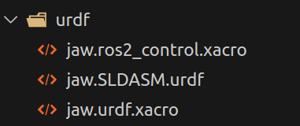
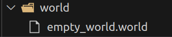
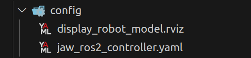
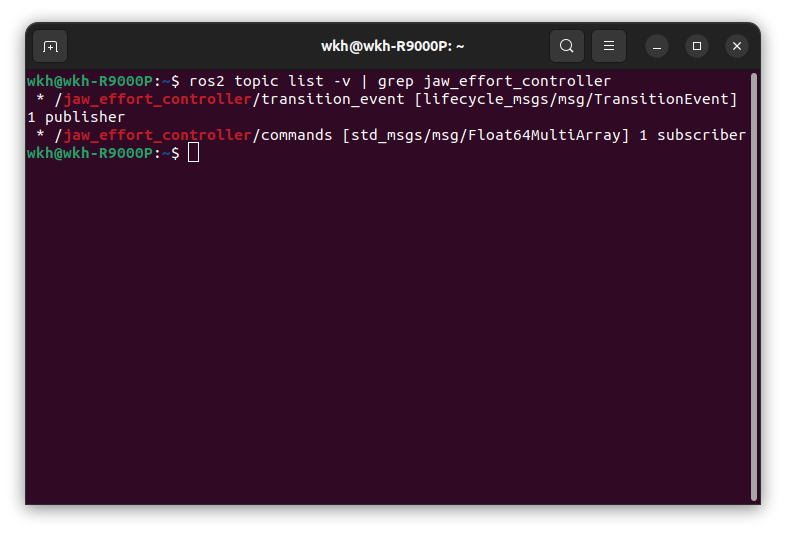

---
tags:
  - ROS2
  - ros2_control
  - Gazebo
date: 2025-03-27
---

# 写在开头

目前来看，中文互联网上还没有一篇完整的教程讲述如何在ros2中，将自己的solidworks模型在rviz中显示，以及在gazebo中通过ros2_contol控制。本篇帖子是作者自己尝试出来的一条路，尽可能覆盖一些可能会踩的坑。

# 将soliworks转成urdf文件

这部分网上有很多的教程，就不多赘述了。唯一要注意的点就是，**一定一定要自己设置每一个link的坐标原点和坐标轴**，不要偷懒！不要相信插件自己生成的坐标轴，很多都是错的。

生成完毕后，你会得到一个文件夹，作者的文件夹名为jaw.SLDASM。打开这个网站进行预览：[URDF Viewer Example](https://gkjohnson.github.io/urdf-loaders/javascript/example/bundle/)，将文件夹整个拖动到网站页面即可，确认没问题后，再切换linux系统进行下一步操作。

# 在rviz中进行可视化

建立工作空间，作者这里工作空间的名字是face_ws。接着建立src，在src中创建功能包，作者这里功能包的名字是face_description。

```bash
ros2 pkg create face_description --build-type ament_cmake --license Apache-2.0
```

接着，你需要在功能包下建立一个名为urdf的文件夹和一个名为meshes的文件夹。并打开你从solidworks得到的文件夹jaw.SLDASM，找到里面的urdf文件夹，将后缀为urdf的那个文件复制粘贴到我们的urdf文件夹下。在新建的meshes文件夹下继续新建名为visual的文件夹，并将jaw.SLDASM下的meshes文件夹中的所有stl文件复制粘贴到我们的meshes/visual文件夹下。到这一步，就可以把jaw.SLDASM文件夹关掉了。



接着，我们需要修改urdf文件。准确来说就是修改所有的stl路径。由于我们的stl文件是全部放到meshes/visual下的，所以需要修改路径的前半部分。Ctrl+F搜索stl文件的路径，改称正确的路径，点击全部替换。修改完成后应如下图所示：



这一步请注意：**请不要使用绝对路径，请使用相对路径，也就是package://开头的格式**，否则在后续rviz中会出现错误。

**更新：这里也可以使用绝对路径，但是需要明确指定协议头 file://，例:file:///home/wkh/face_ws/src/face_description/meshes/visual/base_link.STL**

接着就可以编写rviz启动文件了。

你需要一个保存好的rviz文件。打开rviz，按照你想要的配置设置好后，保存这个文件，命名为display_robot_model.rviz。

接着你需要新建一个config文件夹。在该文件夹下放置保存好的rviz文件。



接着就可以通过launch文件启动rviz并加载模型了。

新建launch文件夹，在文件夹下新建display_robot.launch.py，内容如下：

```python
import launch
import launch_ros
from ament_index_python.packages import get_package_share_directory
import os

import launch_ros.parameter_descriptions

def generate_launch_description():
    #获取默认的urdf路径
    urdf_package_path=get_package_share_directory('face_description')
    default_urdf_path=os.path.join(urdf_package_path,'urdf','jaw.SLDASM.urdf')

    #获取保存的rviz路径
    default_rviz_config_path=os.path.join(urdf_package_path,'config','display_robot_model.rviz')

    #声明一个urdf参数，方便修改
    action_declare_arg_mode_path=launch.actions.DeclareLaunchArgument(
        name='model',default_value=str(default_urdf_path),description='加载的模型文件路径'
    )

    #通过文件路径获取内容。并转换参数值对象，以供传入robot_state_publisher
    substitution_command_result=launch.substitutions.Command(
        ['xacro ',launch.substitutions.LaunchConfiguration('model')])
    robot_description_value=launch_ros.parameter_descriptions.ParameterValue(
        substitution_command_result,value_type=str)

    action_robot_state_publisher=launch_ros.actions.Node(
        package='robot_state_publisher',
        executable='robot_state_publisher',
        parameters=[{'robot_description':robot_description_value}]
    )

    action_joint_state_publisher=launch_ros.actions.Node(
        package='joint_state_publisher',
        executable='joint_state_publisher',
    )

    action_rviz_node=launch_ros.actions.Node(
        package='rviz2',
        executable='rviz2',
        arguments=['-d',default_rviz_config_path]
    )

    return launch.LaunchDescription([
        action_declare_arg_mode_path,
        action_robot_state_publisher,
        action_joint_state_publisher,
        action_rviz_node,
    ])
```

别忘了在CMakeLists.txt中添加如下内容：

```c++
install(DIRECTORY launch urdf meshes config
  DESTINATION share/${PROJECT_NAME}
)
```

然后就可以启动launch文件了

```bash
colcon build
source install/setup.bash
ros2 launch face_description display_robot.launch.py
```

**记得将Fixed Frame修改成base_link。**



到这一步，就完成了模型的可视化。

# 在gazebo中加载模型

由于后续需要给机器人添加人ros2_control插件，所以我们需要新建一个xacro文件来表示我们的机器人。在urdf文件夹下新建jaw.urdf.xacro和jaw.ros2_control.xacro



以下内容仅作参考，具体需要实现什么功能需根据实际情况编写：

jaw.urdf.xacro：

```xml
<?xml version="1.0"?>
<robot xmlns:xacro="http://www.ros.org/wiki/xacro" name="jaw">
    <!-- 生成的urdf文件 -->
    <xacro:include filename="$(find jaw_urdf)/urdf/jaw.SLDASM.urdf"/>

    <!-- ros2_control插件 -->
    <xacro:include filename="$(find jaw_urdf)/urdf/jaw.ros2_control.xacro"/>

    <xacro:jaw_ros2_control/>

</robot>
```

jaw.ros2_control.xacro：

```xml
<?xml version="1.0"?>
<robot xmlns:xacro="http://www.ros.org/wiki/xacro">
    <xacro:macro name="jaw_ros2_control">

    <!-- 系统类型是system -->
    <ros2_control name="JawGazeboSystem" type="system">
            <!-- 指定硬件接口插件为gazebo_ros2_control/GazeboSystem，这是Gazebo与ros2control之间的桥梁。 -->
            <hardware>
                <plugin>gazebo_ros2_control/GazeboSystem</plugin>
            </hardware>
            <!-- 定义关节接口 -->
            <joint name="jaw_J">
                <command_interface name="velocity">
                    <param name="min">-1</param>
                    <param name="max">1</param>
                </command_interface>
                <command_interface name="effort">
                    <param name="min">-0.1</param>
                    <param name="max">0.1</param>
                </command_interface>
                <state_interface name="position" />
                <state_interface name="velocity" />
                <state_interface name="effort" />
            </joint>
        </ros2_control>

    </xacro:macro>
</robot>
```

新建world文件夹，在下面存放gazebo的world文件：



接着编写launch文件来启动gazebo并加载模型，在launch文件夹下新建gazebo_sim.launch.py:

```python
import launch
import launch.launch_description_sources
import launch_ros
from ament_index_python.packages import get_package_share_directory
import os

import launch_ros.parameter_descriptions

def generate_launch_description():
    #获取功能包share路径
    urdf_package_path=get_package_share_directory('face_description')

    default_urdf_path=os.path.join(urdf_package_path,'urdf','jaw.urdf.xacro')

    #获取保存的gazebo世界路径
    default_gazebo_world_path=os.path.join(urdf_package_path,'world','empty_world.world')

    #声明一个urdf参数，方便修改
    action_declare_arg_model_path=launch.actions.DeclareLaunchArgument(
        name='model',default_value=str(default_urdf_path),description='加载的模型文件路径'
    )

    #通过文件路径获取内容。并转换参数值对象，以供传入robot_state_publisher
    #Command函数：创建一个执行命令的动作。通过cat命令得到urdf的内容。
    substitution_command_result=launch.substitutions.Command(
        ['xacro ',launch.substitutions.LaunchConfiguration('model')])
    #ParameterValue函数得到一个ros参数值对象
    robot_description_value=launch_ros.parameter_descriptions.ParameterValue(
        substitution_command_result,value_type=str)

    action_robot_state_publisher=launch_ros.actions.Node(
        package='robot_state_publisher',
        executable='robot_state_publisher',
        parameters=[{'robot_description':robot_description_value}]
    )

    #启动gazebo，并加载指定的世界文件。
    action_launch_gazebo=launch.actions.IncludeLaunchDescription(
        launch.launch_description_sources.PythonLaunchDescriptionSource(
            [get_package_share_directory('gazebo_ros'),'/launch','/gazebo.launch.py']
        ),
        launch_arguments=[('world',default_gazebo_world_path),('verbose','true')]
    )

    #调用spawn_entity.py脚本，从ROS话题/robot_description读取机器人的URDF描述，并在Gazebo中生成名为jaw的实体。
    #-topic /robot_description：指定从该话题获取机器人的URDF模型数据（由robot_state_publisher节点发布），并将其转换成sdf格式。
    action_spawn_entity=launch_ros.actions.Node(
        package='gazebo_ros',
        executable='spawn_entity.py',
        arguments=['-topic','/robot_description',
                   '-entity','jaw']
    )

    return launch.LaunchDescription([
        action_declare_arg_model_path,
        action_robot_state_publisher,
        action_launch_gazebo,
        action_spawn_entity,
    ])
```

接着是重点：**请打开jaw.SLDASM.urdf文件，也就是一开始的urdf文件，并重新修改stl路径为绝对路径。原因：我们urdf文件引用了stl文件，引用形式为 package://；而gazebo会将urdf转为sdf文件，引用形式自动转为model://。这就会冲突导致加载不出模型。解决办法就是直接用绝对路径。但是经实验，在启动rviz的时候必须用相对路径，所以这点很坑。**

作者这里，需要将所有的 **package://**修改成 **/home/wkh/face_ws/src/**

**更新：从一开始就使用绝对路径并加上file://协议头就不会有这个问题了**

ok，接下来就可以启动gazebo_sim.launch.py文件了，不出意外你将成功启动gazebo并且看到你的模型。

如果打开模型之后，你发现你的模型关节自己在抽或者晃动，那么大概率是因为由于我们的urdf模型是自动生成的，所以关节和关节之间是没有摩擦力的，这就导致在重力的作用下，机器人模型的关节会自己晃动。解决办法很简单，就是**给每个 joint 添加摩擦力**。在 URDF 的 `<joint>` 标签内，通过 `<dynamics>` 子标签设置摩擦力。示例如下：

```xml
<joint name="your_joint_name" type="revolute">
  <parent link="link1"/>
  <child link="link2"/>
  <axis xyz="0 1 0"/>
  <limit effort="100" velocity="10" lower="-1.57" upper="1.57"/>
  <!-- 静摩擦力参数（推荐0.01~0.5） -->
  <dynamics
    friction="0.1"
   />
</joint>
```

# 添加 ros2_control

在添加 ros2_control 之前，我们还需要对 URDF 文件进行必要的修改。

如果你仔细观察会发现，在自动生成的 URDF 中，所有关节的 `<limit>` 标签中 `effort` 被设置为 0：

```xml
<limit lower="-3.14" upper="3.14" effort="0" velocity="0" />
```

这会导致Gazebo拒绝任何力矩输入。需修改为合理值（例如effort="100"）：

```xml
<limit lower="-3.14" upper="3.14" effort="100" velocity="10" />
```

好的，到这里，对urdf文件的修改就全部完成了。

接下来，修改jaw.ros2_control.xacro，给其添加上gazebo插件：

```xml
<?xml version="1.0"?>
<robot xmlns:xacro="http://www.ros.org/wiki/xacro">
    <xacro:macro name="jaw_ros2_control">

    <!-- 系统类型是system -->
    <ros2_control name="JawGazeboSystem" type="system">
            <!-- 指定硬件接口插件为gazebo_ros2_control/GazeboSystem，这是Gazebo与ros2control之间的桥梁。 -->
            <hardware>
                <plugin>gazebo_ros2_control/GazeboSystem</plugin>
            </hardware>
            <!-- 定义关节接口 -->
            <joint name="jaw_J">
                <command_interface name="velocity">
                    <param name="min">-1</param>
                    <param name="max">1</param>
                </command_interface>
                <command_interface name="effort">
                    <param name="min">-0.1</param>
                    <param name="max">0.1</param>
                </command_interface>
                <state_interface name="position" />
                <state_interface name="velocity" />
                <state_interface name="effort" />
            </joint>
        </ros2_control>

<!-- 需要gazebo插件来解析ros2_control标签，同时通过yaml配置文件传递一些参数 -->
<gazebo>
        <plugin filename="libgazebo_ros2_control.so" name="gazebo_ros2_control">
            <parameters>$(find face_description)/config/jaw_ros2_controller.yaml</parameters>
        </plugin>
</gazebo>
    </xacro:macro>
</robot>
```

在config文件夹下新建jaw_ros2_controller.yaml文件:



编写yaml文件内容：

```yaml
#控制器管理器全局配置
controller_manager:
  ros__parameters:
    update_rate: 100  # 控制器更新频率100Hz（10ms周期）
    use_sim_time: true  # 使用仿真时钟而非真实时间
```

ok，从理论上来讲，现在已经成功给机器人添加添加ros2_control了。接下来，可以根据需要给机器人添加控制器了。

作者这里以给jaw_L这个link添加一个力控制器为例：

首先修改yaml文件，添加力控制器部分。

```yaml
#控制器管理器全局配置
controller_manager:
  ros__parameters:
    update_rate: 100  # 控制器更新频率100Hz（10ms周期）
    use_sim_time: true  # 使用仿真时钟而非真实时间

    #发布关节状态控制器
    jaw_joint_state_broadcaster:
      type: joint_state_broadcaster/JointStateBroadcaster
      use_sim_time: true

    #发布力控制器
    jaw_effort_controller:
      type: effort_controllers/JointGroupEffortController

# 力控制器详细配置
jaw_effort_controller:
  ros__parameters:
    joints: # 控制的关节列表
      - jaw_J
    command_interfaces:  # 指令接口类型：力控接口
      - effort
    state_interfaces: # 状态反馈接口
      - position # 位置反馈
      - velocity # 速度反馈
      - effort # 实际力矩反馈
```

接着，修改gazebo_sim.launch.py：

```python
import launch
import launch.launch_description_sources
import launch_ros
from ament_index_python.packages import get_package_share_directory
import os

import launch_ros.parameter_descriptions

def generate_launch_description():
    #获取功能包share路径
    urdf_package_path=get_package_share_directory('face_description')

    default_urdf_path=os.path.join(urdf_package_path,'urdf','jaw.urdf.xacro')

    #获取保存的gazebo世界路径
    default_gazebo_world_path=os.path.join(urdf_package_path,'world','empty_world.world')

    #声明一个urdf参数，方便修改
    action_declare_arg_model_path=launch.actions.DeclareLaunchArgument(
        name='model',default_value=str(default_urdf_path),description='加载的模型文件路径'
    )

    #通过文件路径获取内容。并转换参数值对象，以供传入robot_state_publisher
    #Command函数：创建一个执行命令的动作。通过cat命令得到urdf的内容。
    substitution_command_result=launch.substitutions.Command(
        ['xacro ',launch.substitutions.LaunchConfiguration('model')])
    #ParameterValue函数得到一个ros参数值对象
    robot_description_value=launch_ros.parameter_descriptions.ParameterValue(
        substitution_command_result,value_type=str)

    action_robot_state_publisher=launch_ros.actions.Node(
        package='robot_state_publisher',
        executable='robot_state_publisher',
        parameters=[{'robot_description':robot_description_value}]
    )

    #启动gazebo，并加载指定的世界文件。
    action_launch_gazebo=launch.actions.IncludeLaunchDescription(
        launch.launch_description_sources.PythonLaunchDescriptionSource(
            [get_package_share_directory('gazebo_ros'),'/launch','/gazebo.launch.py']
        ),
        launch_arguments=[('world',default_gazebo_world_path),('verbose','true')]
    )

    #调用spawn_entity.py脚本，从ROS话题/robot_description读取机器人的URDF描述，并在Gazebo中生成名为jaw的实体。
    #-topic /robot_description：指定从该话题获取机器人的URDF模型数据（由robot_state_publisher节点发布），并将其转换成sdf格式。
    action_spawn_entity=launch_ros.actions.Node(
        package='gazebo_ros',
        executable='spawn_entity.py',
        arguments=['-topic','/robot_description',
                   '-entity','jaw']
    )

    # 此部分为ros2_control。实现启动时自动加载并激活 jaw_joint_state_broadcaster 控制器
    action_load_joint_state_controller = launch.actions.ExecuteProcess(
        cmd=['ros2', 'control', 'load_controller', '--set-state', 'active',
            'jaw_joint_state_broadcaster'],
        output='screen'
    )

    # 加载并激活 jaw_effort_controller 控制器
    action_load_jaw_effort_controller = launch.actions.ExecuteProcess(
        cmd=['ros2', 'control', 'load_controller', '--set-state', 'active','jaw_effort_controller'],
        output='screen')

    return launch.LaunchDescription([
        action_declare_arg_model_path,
        action_robot_state_publisher,
        action_launch_gazebo,
        action_spawn_entity,
        # 事件动作，当加载机器人结束后执行
        launch.actions.RegisterEventHandler(
            event_handler=launch.event_handlers.OnProcessExit(
                target_action=action_spawn_entity,
                on_exit=[action_load_joint_state_controller],)
            ),
        # 事件动作，在关节状态发布后执行，发布力控制器
        launch.actions.RegisterEventHandler(
        event_handler=launch.event_handlers.OnProcessExit(
            target_action=action_load_joint_state_controller,
            on_exit=[action_load_jaw_effort_controller],)
            ),
    ])
```

重新构建并启动仿真，接着就可以发布力控命令了。

打开新的终端，输入：

```bash
ros2 topic list -v | grep jaw_effort_controller
```

你就可以看到jaw_effort_controller相关话题了。



接下来就可以发布topic了。

```bash
# 发送单个力值 0.5
ros2 topic pub /jaw_effort_controller/commands std_msgs/msg/Float64MultiArray "{data: [0.5]}"

# 持续发送力值 -0.3 (10Hz)
ros2 topic pub /jaw_effort_controller/commands std_msgs/msg/Float64MultiArray "{data: [-0.3]}" -r 10
```

至此，成功完成使用ros2_control来控制机器人。
