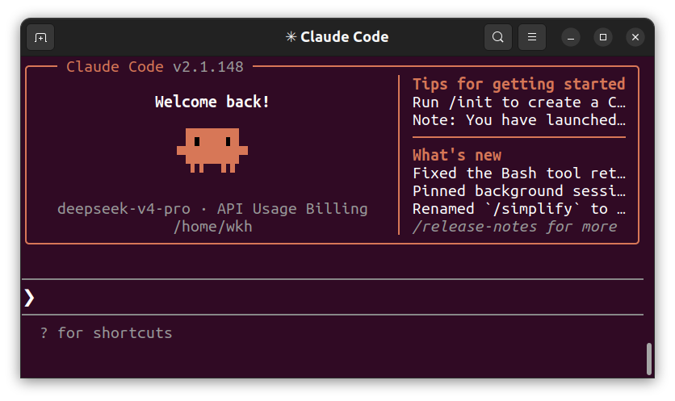

---
tags:
  - claude
date: 2026-05-24
---

# Ubuntu安装Claude Code并介入DeepSeek



## 1. 准备环境（安装 Node.js）

Claude Code 依赖 Node.js 环境，要求版本 **v18+**。推荐使用 `nvm`（Node Version Manager）来管理 Node.js 版本，避免全局权限冲突。

**下载并安装 nvm：**

```bash
curl -o- https://raw.githubusercontent.com/nvm-sh/nvm/v0.39.7/install.sh | bash
```

**使环境变量生效：**

```bash
source ~/.bashrc
```

> 如果你使用的是 zsh，请改为 `source ~/.zshrc`。

**安装并切换到 Node.js 20.20.1 版本：**

```bash
nvm install 20.20.1
nvm use 20.20.1
```

**验证安装是否成功（应正常返回版本号）：**

```bash
node -v
npm -v
```

---

## 2. 安装 Claude Code

环境准备就绪后，通过 npm 全局安装 Claude Code 终端工具。

**执行全局安装命令：**

```bash
npm install -g @anthropic-ai/claude-code
```

**验证安装（确保输出正常的版本号）：**

```bash
claude --version
```

---

## 3. 安装与配置 CC-Switch

无需手动修改繁琐的系统环境变量，通过 CC-Switch 客户端可以实现图形化一键配置与切换。

**安装 CC-Switch：**

去github上直接搜索CC-Switch，搜出来第一个就是，下载它的安装包。

在终端中进入你下载好的安装包目录，执行以下命令，deb包名改成你真实的包名：

```bash
sudo dpkg -i CC-Switch-v3.15.0-Linux-x86_64.deb
```

> 如果提示缺少依赖，可以运行 `sudo apt --fix-broken install` 修复。

**打开 CC-Switch：**

安装完成后，在 Ubuntu 应用程序菜单中找到并打开 **CC-Switch**。

**添加 API 配置：**

在软件界面中，**直接点击"加号（＋）"按钮**来添加 API 配置，填入以下核心信息：

| 配置项   | 建议值                                    |
| -------- | ----------------------------------------- |
| Base URL | `https://api.deepseek.com/anthropic`      |
| API Key  | 你的 DeepSeek API Key（必填，请替换为真实值，没有则需要在deepseek官网注册一个） |
| Model    | `deepseek-v4-pro[1m]`                     |

保存后即可一键开启代理转发。

---

## 4. 启动与日常使用

配置完成后，建议在具体的代码项目目录中启动 Claude Code，以便 AI 能够完美理解你的代码上下文。

**进入你的代码项目文件夹：**

```bash
cd /path/to/your/project
```

**启动 Claude Code：**

```bash
claude
```

**开始使用：**

现在你可以在 `>` 提示符后直接使用自然语言向 DeepSeek 提问，或下达代码编写、重构、调试等指令。

**常用操作速查：**

| 操作         | 命令/方式            |
| ------------ | -------------------- |
| 退出会话     | `/exit`              |
| 查看帮助     | `/help`              |
| 清除对话历史  | `/clear`             |
| 查看当前状态  | `/status`            |

---

# Ubuntu 安装 Codex CLI

Codex CLI 是运行在终端中的 Codex 客户端。它可以读取当前项目、修改文件、运行命令并协助完成编程任务。

> 前文已经通过 NVM 安装了 Node.js，因此可以直接复用现有的 Node.js 和 npm 环境。

## 1. 检查 Node.js 和 npm

在终端中输入：

```bash
node -v
npm -v
```

如果都能输出版本号，就可以继续安装。如果提示命令不存在，请先按照本文前面的步骤安装 Node.js，或重新加载 NVM：

```bash
source ~/.bashrc
nvm use 20.20.1
```

## 2. 下载并安装 Codex CLI

使用 npm 全局安装官方 CLI：

```bash
npm install --global @openai/codex
```

安装完成后，检查 Codex 是否可用：

```bash
codex --version
codex --help
```

只要能正常输出版本号和帮助信息，就说明 CLI 已安装成功。

> 如果 Node.js 是通过 NVM 安装的，通常不要在 npm 命令前添加 `sudo`，否则可能导致权限和路径混乱。

## 3. 登录 Codex

这是最简单的登录方式：

```bash
codex login
```

命令执行后会打开浏览器，按页面提示完成授权即可。

## 4. 启动 Codex

先进入需要处理的项目目录，再启动 Codex：

```bash
cd ~/Projects/your-project
codex
```

Codex 会以当前目录作为工作目录，因此建议从具体的项目文件夹中启动，而不要直接在整个主目录中运行。

## 5. 常用命令

| 命令                | 作用        |
| ----------------- | --------- |
| `codex`           | 启动交互式终端界面 |
| `codex --help`    | 查看帮助和可用参数 |
| `codex --version` | 查看当前版本    |
| `codex resume`    | 继续之前的会话   |
| `codex doctor`    | 检查环境与运行问题 |
| `codex logout`    | 注销当前账号    |

## 6. 更新或卸载

更新到 npm 上发布的最新版本：

```bash
npm install --global @openai/codex@latest
```

卸载 Codex CLI：

```bash
npm uninstall --global @openai/codex
```

> Codex 可以执行命令和修改文件。在重要项目中使用前，建议先提交 Git 快照，并在执行敏感命令前仔细检查操作内容。
