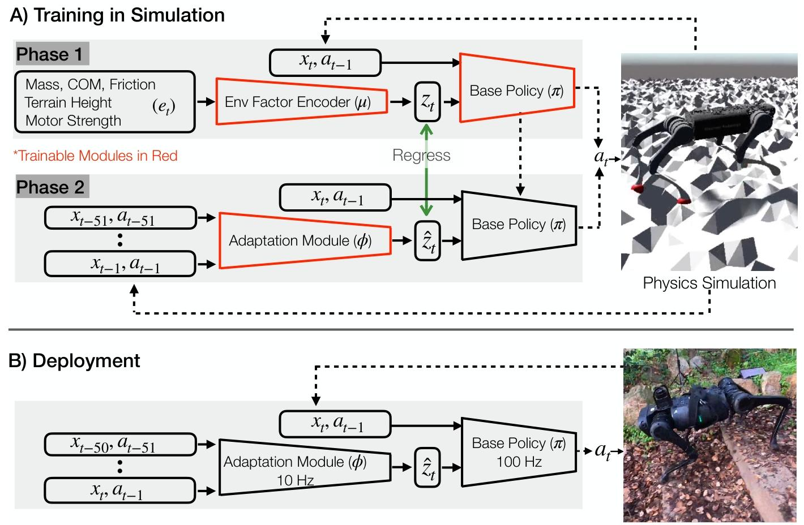
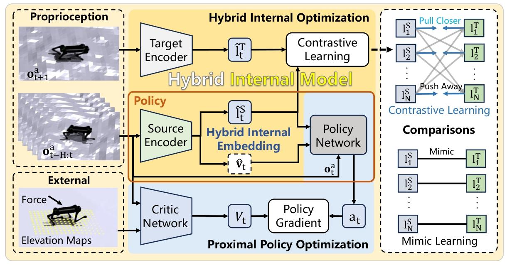

---
tags:
  - 强化学习
  - 运动控制
date: 2026-05-25
---

# RMA

RMA（Rapid Motor Adaptation）的核心算法分为两个独立训练但在部署时协同工作的子系统：基础策略（Base Policy）与自适应模块（Adaptation Module） 。

## 1. 基础策略与环境因子编码（Phase 1：仿真环境端到端强化学习）

在仿真环境中，算法拥有访问真实物理环境特权信息的权限。第一阶段的目标是联合训练**基础策略网络 $\pi$** 和**环境因子编码器 $\mu$**。

* **状态与维度定义：**
    * $x_t \in \mathbb{R}^{30}$：当前机器人本体状态（包含关节位置、速度、机身姿态及足端接触标志）。
    * $a_{t-1} \in \mathbb{R}^{12}$：上一控制帧的动作。
    * $e_t \in \mathbb{R}^{17}$：环境特权信息向量（包含摩擦力、质量、坡度、电机强度等）。
    * $z_t \in \mathbb{R}^8$：低维环境隐向量（Extrinsics Vector）。
    * $a_t \in \mathbb{R}^{12}$：当前帧输出的期望关节位置指令。

* **前向传播数学模型：**
    环境特权信息 $e_t$ 首先被多层感知机（MLP）编码器 $\mu$ 压缩为低维隐向量 $z_t$：
    $$z_t = \mu(e_t)$$

    随后，基础策略网络 $\pi$ 结合本体状态 $x_t$、历史动作 $a_{t-1}$ 和隐向量 $z_t$ 计算出当前的目标动作 $a_t$：
    $$a_t = \pi(x_t, a_{t-1}, z_t)$$

* **优化目标（Objective Function）：**
    使用无模型强化学习（PPO）对 $\pi$ 和 $\mu$ 进行端到端联合优化，以最大化期望折扣回报：

$$J(\pi,\mu) = \mathbb{E}_{\tau \sim p(\tau\mid\pi,\mu)} \left[ \sum_{t=0}^{T-1} \gamma^t r_t \right]$$

其中，$\tau$ 表示机器人与环境交互产生的一条完整轨迹，$r_t$ 是第 $t$ 步的奖励，$\gamma\in(0,1]$ 是折扣因子。展开后，单条轨迹的折扣回报为 $r_0+\gamma r_1+\gamma^2r_2+\cdots$，因此越远期的奖励通常权重越小。外层期望表示对不同环境参数及交互轨迹取平均。严格来说，PPO实际优化的是该目标对应的代理目标，但其最终目的仍是提高上述期望折扣回报。

* **奖励函数公式设计（Reward Function）：**
    单步奖励 $r_t$ 由以下 10 个子项加权相加构成，这是约束机器人生成自然步态（无额外参考轨迹）的核心：
    1. **前向速度 (Forward):** $\min(v_x^t, 0.35)$
    2. **侧向移动与自转惩罚 (Lateral Movement):** $-||v_y^t||^2 - ||\omega_{\text{yaw}}^t||^2$
    3. **机械功惩罚 (Work):** $-|\tau^T \cdot (q^t - q^{t-1})|$
    4. **地面冲击力惩罚 (Ground Impact):** $-||f^t - f^{t-1}||^2$
    5. **力矩平滑度 (Smoothness):** $-||\tau^t - \tau^{t-1}||^2$
    6. **动作幅度惩罚 (Action Magnitude):** $-||a^t||^2$
    7. **关节速度惩罚 (Joint Speed):** $-||\dot{q}^t||^2$
    8. **姿态偏离惩罚 (Orientation):** $-||\theta_{\text{roll, pitch}}^t||^2$
    9. **Z轴加速度惩罚 (Z Acceleration):** $-||v_z^t||^2$
    10. **足端打滑惩罚 (Foot Slip):** $-||\text{diag}(g^t) \cdot v_f^t||^2$

## 2. 自适应模块（Phase 2：监督学习与在线时序推断）

真实物理部署中无法获取 $e_t$，因此需要利用自适应模块 $\phi$ 从机器人的历史时序数据中在线估计隐向量。

* **输入与输出定义：**
    * **输入：** 过去 $k$ 步（论文中 $k=50$，对应 $0.5$ 秒）的状态与动作历史序列 $x_{t-k:t-1}$ 及 $a_{t-k:t-1}$。
    * **输出预测：** 估计的隐向量 $\hat{z}_t$。
    * **计算公式：**

    $$\hat{z}\_t = \phi(x\_{t-k:t-1}, a\_{t-k:t-1})$$

* **模型结构与损失函数：**
    $\phi$ 被实现为一个 1-D CNN 以捕捉时序相关性。其训练不再使用强化学习，而是通过监督学习对齐第一阶段编码器 $\mu$ 产生的真实隐向量 $z_t$，最小化均方误差（MSE）：
    $$\text{MSE}(\hat{z}_t, z_t) = ||\hat{z}_t - z_t||^2$$
    其中 $z_t = \mu(e_t)$ 为真实标签。

* **数据收集策略 (DAgger 思想)：**
    为了保证部署时的鲁棒性，收集训练 $\phi$ 的数据集时，必须使用带有随机初始化 $\phi$ 预测误差的 $\hat{z}_t$ 来驱动基础策略，强迫机器人经历“策略偏离（Deviations from the expert trajectory）”，从而让 $\phi$ 学习在失稳状态下如何正确预测以恢复平衡。

## 3. 异步部署（Asynchronous Deployment）

在真机上，两个神经网络解耦并以不同频率独立运行：

* **自适应模块 $\phi$**：运行频率较低（10 Hz），以降低机载计算压力，每 $0.1$ 秒处理一次沉重的 50 帧历史序列并更新 $\hat{z}_t$。
* **基础策略 $\pi$**：运行频率极高（100 Hz），从内存中读取由 $\phi$ 异步生成的最新 $\hat{z}_t$，结合当前帧状态计算动作并输出给底层 PD 控制器，保证姿态控制的绝对连贯与防跌倒响应。

# HIM

## 一、 HIM 算法核心思想与优势

HIM（Hybrid Internal Model，发表于 ICLR 2024）是足式机器人运控领域的一项前沿工作。它解决了传统两阶段方法（如 RMA）中存在的“教师-学生网络模仿学习导致的信息损失”以及“真机遭遇未见过轨迹时极易崩溃”的痛点。

* **内模控制（IMC）哲学**：HIM 认为机器人不需要显式、精确地去辨认外部环境的具体参数（如摩擦系数到底是 $0.1$ 还是 $0.2$）。它将摩擦力、地形高度图等一切外部环境变化统一视为对系统的**物理扰动（Disturbance）**。
* **混合内部表征（Hybrid Internal Embedding）**：模型仅凭机器人的**本体感受历史时序数据**，即可在线提取出包含显式速度预测 $\hat{v}_t$ 和隐式稳定性表征 $\hat{l}^S_t$ 的混合向量。
* **极致的样本效率**：相比于 RMA 需要 $12.8$ 亿帧的仿真训练，HIM 仅需 **$2$ 亿帧（在单张 RTX 4090 上训练约 1 小时）** 即可收敛，且展现出极强的端到端抗干扰能力与零样本真机迁移（Sim2Real）泛化表现。

## 二、 HIM 架构图深度拆解

整个 HIM 训练架构可以划分为**数据输入（左）**、**核心大脑（中）**、 **自监督优化标准（右）** 三大区域。

### 1. 数据输入端 (左侧区域)

HIM 将输入数据严格解耦为两类，从而保证了仿真到现实的无缝切换：

* **Proprioception（本体感受 - 上方虚线框）**：真机部署时“合法”的传感器数据。
    * $o^a_{t-H:t}$：过去 $H$ 个时间步的**历史观测时序序列**（论文中默认 $H=5$，包含历史关节位置 $\theta$、关节速度 $\dot{\theta}$、机身角速度 $\omega$ 以及重力方向 $g$）。
    * $o^a_{t+1}$：机器人由于当前动作产生的**未来下一个时间步的状态（Successor State）**。
* **External（外部特权信息 - 下方虚线框）**：包含地形高度图（Elevation Maps）和机身受到的外力扰动（Force）。这些属于“上帝视角”数据，**只喂给仿真训练中的裁判（Critic Network）**，真机部署时完全不可见。

### 2. 核心计算模块 (中间区域)

中间区域由三种底色的框组成，分别代表不同的网络功能优化流：

* **蓝色区：基础强化学习底座 (PPO)**
    * **Critic Network（价值网络）**：看着包含特权信息的全状态，计算出当前状态的精确价值 $V_t$。
    * **Policy Gradient（策略梯度）**：结合 $V_t$ 算出的优势函数（Advantage），通过 PPO 算法更新策略网络。
* **橙色区：真机部署的核心策略网络 (Policy)**
    * **Source Encoder（源编码器）**：吃进历史时序缓存 $o^a_{t-H:t}$，通过一个 3 层 MLP 进行前向传播，输出混合内部表征（包含显式速度 $\hat{v}_t$ 和隐式稳定性状态 $\hat{l}^S_t$）。
    * **Policy Network（策略网络 / Actor）**：充当“小脑肌肉控制器”，它吃进当前的瞬间观测 $o^a_t$ 以及刚才源编码器吐出的混合表征，最终计算出 12 维的电机期望关节位置偏置 $a_t$。
* **黄色区：混合内部优化 (Hybrid Internal Optimization, HIO)**
    * **Target Encoder（目标编码器）**：在仿真训练时，它吃进机器狗下一帧的真实身体反应 $o^a_{t+1}$，生成一个未来的“目标表征” $\hat{l}^T_t$。
    * **优化任务**：通过对比学习（Contrastive Learning），强迫上面的源编码器根据过去的历史去“逼近”未来的真实系统响应，实现隐式内模扰动估计。

### 3. 学习范式对比 (右侧区域 - Comparisons)

右侧区域是作者放置的“学习标准”对比，用于展现对比学习相较于传统方法的优越性：

* **下方：Mimic Learning（模仿学习 / 传统两阶段范式）**
    * 呈现死板的一对一黑色连线。它属于硬性的回归拟合（Regression），强行要求学生网络输出的数值与专家网络绝对相等（$\hat{l}^S = \hat{l}^T$），容错率极低，极易拟合仿真域随机化带来的噪声。
* **上方：Contrastive Learning（对比学习 —— HIM 的灵魂）**
    * 呈现网状交叉连线。通过类似 SwAV 算法的聚类思想，设置了 **Pull Closer（拉近）** 和 **Push Away（推开）** 机制。
    * **正样本拉近**：让同一条运动轨迹下的预测特征 $\hat{l}^S_1$ 与其真实未来的未来特征 $\hat{l}^T_1$ 相互靠近。
    * **负样本推开**：将当前的预测特征 $\hat{l}^S_1$ 与**其他完全不同场景/地形**下的特征 $\hat{l}^T_2 \dots \hat{l}^T_N$ 强行推开。网络不需要死记硬背摩擦力的数值，只需学会“区分”不同的地形反馈，因而具备极强的鲁棒性。

## 三、 核心工程机制与解惑

### 1. 概念厘清：监督学习、模仿学习与对比学习

* **监督学习**：死磕人工标注的“绝对标准答案”，通过计算预测与标签的数学误差（如 MSE）来修正参数。
* **模仿学习**：本质上是一种以“专家/教师网络的行为特征”作为标签的特殊监督学习。在运控中（如 RMA 蒸馏阶段），它强行要求学生网络去一比一复制老师的动作或隐向量，容易因真机产生轻微误差而引发恶性的“分布偏移（摔倒）”。
* **对比学习**：属于无监督/自监督学习。它不需要绝对的标准答案，而是通过拉近正样本、推开负样本来学习数据内部的**相对距离与相对关系**。这让 HIM 摆脱了死记硬背，学会了“举一反三”地分类理解环境扰动。

### 2. PPO 架构中的 Actor 与 Critic

在架构图中，PPO 算法的演员（Actor）和评论家（Critic）被完全拆开：

* **Policy Network 就是 Actor**：它被画在橙色部署框中，因为它只依赖合法的本体感受。它是需要最终“上战场”部署到物理样机上的核心控制器。
* **Critic Network 待在底部的训练框中**：它拿着包含地形和外力的“作弊剧本（特权信息）”在仿真后台充当教练。一旦训练结束，**整个 Critic 网络及相关的特权输入、策略梯度模块都会被彻底扔掉**，真机上不需要也不可能运行 Critic。

## 四、 真机部署流水线 (Deployment Pipeline)

当在仿真（Isaac Gym）中完成交替迭代训练后，烧录到真实机器人机载电脑（如 Jetson Orin / 工控机）上的**只有中间橙色框里的两个神经网络组合**（串联推理流水线）：

[传感器数据采集 (IMU/编码器)] ──> 滚动更新历史缓存 Buffer ($o^a_{t-H:t}$)

│

▼

[Source Encoder 前向推理 (50Hz)] ──> 提取混合内部表征 ($v_hat_t, l^S_hat_t$)

│

▼

[Policy Network (Actor) 推理 (50Hz)] ──> 计算 12 维电机目标角度 ($a_t$)

│

▼

[真机底层固件 PD 控制器 (500Hz)] ──> 极速高频跟踪，转化为扭矩驱动物理关节

* **异步运行频率**：在真机上，`Source Encoder` 与 `Policy Network (Actor)` 的组合推理循环以 **$50\text{ Hz}$** 的频率执行，而底层的关节电机的高频 PD 跟踪控制（由机器人硬件 SDK 负责）则运行在 **$500\text{ Hz}$**，从而确保高动态动作的丝滑跟踪。
* **退役模块**：`Target Encoder`（因为无法预知真机未来状态）、`Critic Network`（教练网络）以及所有的外部特权信息（地形高度、受力）在部署时全被丢弃，真机实现了完全自主的“闭眼”敏捷控制。
