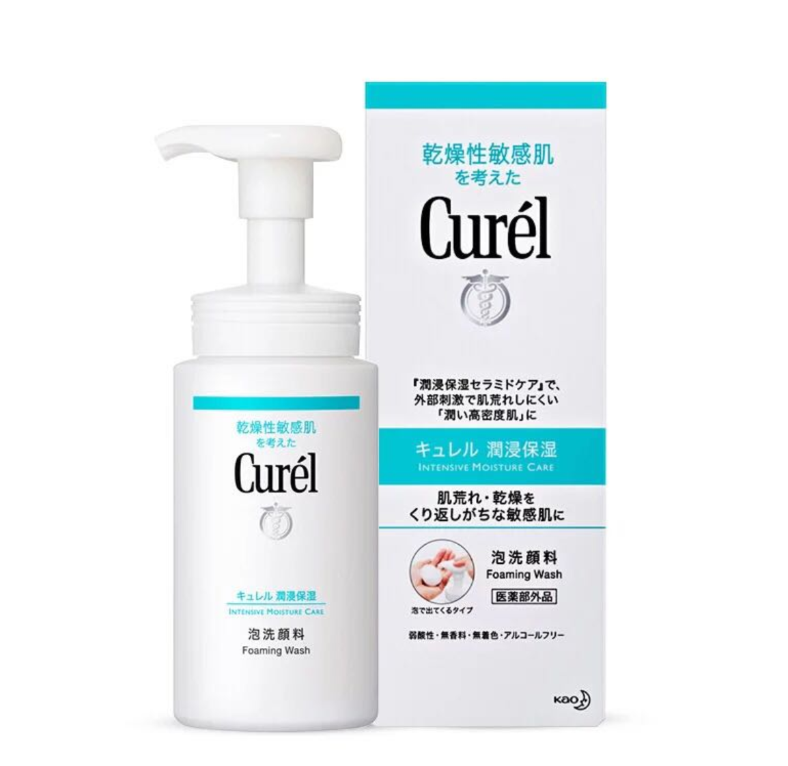

---
tags:
  - 护肤
date: 2025-04-03
---

最近小坷心血来潮开始尝试护肤，做了些功课，写篇笔记记录下自己的一些理解。

# 回顾过去与护肤有关的故事

在刚高考结束上大一的时候，我脸上的痘痘还是挺严重的。

那个时候对皮肤没有正确的理解，错误地认为长痘是因为皮肤油脂分泌过多，只需要勤洗脸就不长痘了。

这种观点错的离谱，直接导致了在大二的时候皮肤屏障受损，脸上大面积泛红的情况。

当时我甚至认为，不就是去油吗？那洗面奶能去油，洗发水也可以。于是我甚至习惯性地在洗头的时候顺便用洗发水洗脸。这种做法省事，但极其错误。在皮肤屏障受损之后，脸部的大面积泛红和痘痘更严重了。这时候我开始意识到不对，为什么洗脸反而越洗皮肤越差？

于是我开始检索关于护肤的相关知识，了解了关于皮肤**水油平衡**和**皮肤屏障**的概念。

# 什么是水油平衡？

水：皮肤角质层含水量（10%-20%为健康状态），由天然保湿因子（NMF）和细胞间脂质锁住水分。

油：皮脂腺分泌的油脂（含甘油三酯、角鲨烯等），形成天然皮脂膜保护皮肤。

平衡状态：水分充足且油脂分泌适度，皮肤触感柔润不黏腻。

所以明白了吗？好的皮肤状态不是疯狂去油，完全没有油，而是有适当的油。

其实这点很好理解：为什么小孩子即使不洗脸皮肤也依旧很好？因为水油天生本是平衡的，那什么时候开始出现不平衡呢？当一个人进入青春期，皮肤油脂分泌旺盛，从这个时候开始，平衡就被打破了。往后就需要科学的介入，才能维持这个平衡。

了解了这个原则，也就能解释为什么我当时越洗脸皮肤越差了。用皂基洗面奶甚至洗发水去油，反而刺激皮脂腺分泌油（因为此时皮肤太干了，需要分泌油脂来保护自己）。这种过度清洁，最终导致了诡异的外油内干现象。此时我的皮肤的水油状态已经完全失衡，皮肤屏障严重受损。

# 什么是皮肤屏障？

屏障结构解析：

1. 砖墙结构：角质细胞（砖块）+ 细胞间脂质（水泥）
2. 关键成分：神经酰胺（占50%）、胆固醇、游离脂肪酸
3. 核心功能：锁水保湿 + 抵御外界刺激（细菌/污染物/紫外线）

水油失衡会削弱屏障：缺水导致角质层干裂，油多诱发炎症因子释放。

屏障受损同时加剧水油失衡：失去锁水能力→越干越油，防御力下降→更易敏感。

这样一套恶性循环下来，导致我在大二的时候脸部大面积地泛红爆痘。

# 当时的我如何挽救的

皮肤屏障受损之后，最简单的方法就是清水洗脸，不用洗面奶，什么洗面奶都不用，就用清水洗。坚持一段时间，让自己的脸皮先“厚”起来。当时我大概用清水洗了一个月的脸，显著感觉皮肤没有那么敏感了。

在皮肤状态差不多稳定之后，就可以开始用洗面奶了，一定要用氨基酸洗面奶而不是皂基洗面奶，因为氨基酸洗面奶的成分更加温和，不会刺激皮肤。

直到现在，我都在坚持早上用清水洗脸，晚上用氨基酸洗面奶洗脸。没有其他的护肤步骤，皮肤也已一直处于正常的状态。偶尔长个痘也不会焦虑，再也没有出现过大面积泛红长痘的情况。

# 为什么突然想护肤

因为最近经常熬夜，皮肤暗沉发黄，镜子里看着很糟糕，于是决定开始研究护肤。

# 护肤步骤

总体原则还是精简护肤，锦上添花的东西，没必要花太多精力。

护肤简单来说就是洁面+水乳+精华+防晒这四个部分组成，其中水乳是指的是爽肤水和乳液这两个部分。每个部分作用如下：

1. 洁面：没啥好说的，就是把脸洗干净。
2. 水乳：爽肤水的作用就是补水。我一开始也不理解，刚洗完脸不是湿的吗？为什么还要补水？其实洗完脸后，脸上的水干了之后，脸部是非常干燥紧绷的，需要及时补水。爽肤水不是普通的水。普通水在皮肤表面蒸发时，会带走更多水分（类似湿毛巾晾干后变硬），同时缺乏保湿剂，无法阻止水分流失。我的理解是，爽肤水/保湿喷雾是有战略的补水，普通水只是物理润湿。乳液则是用油脂成分（角鲨烷/乳木果油）形成透气膜防止水分蒸发。同时乳液还有一点点的功能性的作用比如舒缓镇定。两者通常搭配使用，简称水乳。
3. 精华：精华是一种**功能性产品**的统称，它没有特定的作用，但有很多分类，每个分类精准解决特定问题，如：祛痘精华，抗氧化精华等等。精华其实不建议每天都用。很多精华ph值是很低的，类似于酸的效果，原理就是很简单的摧毁你原有的角质层，迫使你长出新的角质层，然后皮肤看上去就像变年轻了。但这种产品经常用就容易破坏皮肤屏障，让皮肤变得敏感了。还有那种修红精华，用多了之后皮肤会产生类似耐药性和依赖性，可能会出现皮肤自己淡化痘印的能力下降的情况。还有的精华，例如b5精华，它的作用是镇定修护，类似于好一点的水乳，这种天天用也无所谓。总之精华品类很多，需要具体情况具体分析。
4. 防晒：防晒的作用是**防紫外线，抗氧化**。最好的防晒方式一定是硬防晒，即打伞或者戴遮阳帽。如果不愿意打伞或者戴遮阳帽，那么只能涂防晒霜。防晒霜分为spf30和spf50。spf30的防晒霜用洗面奶就可以洗干净，但spf50的防晒霜**一定**要用卸妆油或者卸妆膏或者洗卸二合一洗面奶来卸妆（是的，防晒霜也是妆）。这里提一嘴，如果你去抖音或者小红书搜索防晒霜推荐，你会发现搜到的产品简直五花八门。有的博主的红榜产品在别的博主那里是黑榜，为啥？很简单：他们接的广子不是同一家。在美妆这个领域，我不相信有所谓的为爱发电，有一个算一个全是广告。你所能做的，是结合自己的判断，在众多广子里面挑选一只，并祈祷这次不要翻车。

然后我**个人理解**，水乳其实是非必要的，精华也有补水的作用。说到底其实普通水也能补水，只要上脸之后拿一层防晒霜给它封起来就是一样的。但是我手头正好有保湿喷雾，那就不用白不用。但按照我个人理解，就算没有我也不会去花钱买水乳。

ok接下来是得出的护肤完整步骤：

**早上**：

1. 清水洗脸：洗完脸**不要用毛巾**，而是用一次性洗脸巾擦干。
2. 保湿喷雾：这一步用爽肤水应该更好，但是我觉得保湿喷雾更方便，我的理解是主要功能反正都是补水，不差那点功效。
3. 防晒：我不觉得稍微晒晒太阳有什么不好，但如果长时间在户外，还是打个伞吧。如果不方便打伞也可以备一支防晒霜。

**晚上**

1. 洁面：如果没涂防晒，就用氨基酸洗面奶洗脸；如果涂了防晒，就用卸妆油卸妆。
2. 保湿喷雾
3. 精华

# 使用产品

洗面奶：cruel珂润洗面奶

保湿喷雾：弥玥泉保湿喷雾

精华：purid二代精华，科颜萃b5精华

# 写在最后

其实护肤是个锦上添花的东西，没必要焦虑。**坚持运动+清淡饮食+不熬夜**，往往比什么护肤品都管用。现在的厂商，满脑子都是你钱包里的钱，他们真的关心你皮肤会不会变好吗？你点开任何一个护肤品的商品界面的介绍，你会觉得这个护肤品简直无所不能，油痘肌也能用，干皮也能用，甚至敏感肌也能用，又不黏腻又不假白效果又好。可事实真是这样吗？你只有买回来才知道商家吹的牛有多大。我见过很多人从不护肤，但他们的皮肤状态非常好；我也见过一些人，瓶瓶罐罐一大堆，皮肤却经常敏感泛红。在消费主义盛行的时代，保持自己的理解和判断，真的很重要。
